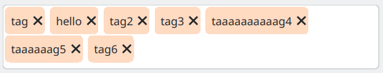
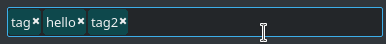

# tags

A widget (Qt5/Qt6) for tag editing




Python instructions:

```bash
mkdir build
cmake . -B build -G Ninja \
  -DCMAKE_BUILD_TYPE=Release \
  -DCMAKE_INSTALL_PREFIX=$(pwd)/py/EverloadTags
ninja -C build/
ninja -C build/ install
cd py
python demo.py
```

You can either:
Use pip to add EverloadTags to your site-packages

```bash
pip install ./py
```

Copy the py/EverloadTags folder to your python project and import see demo.py
