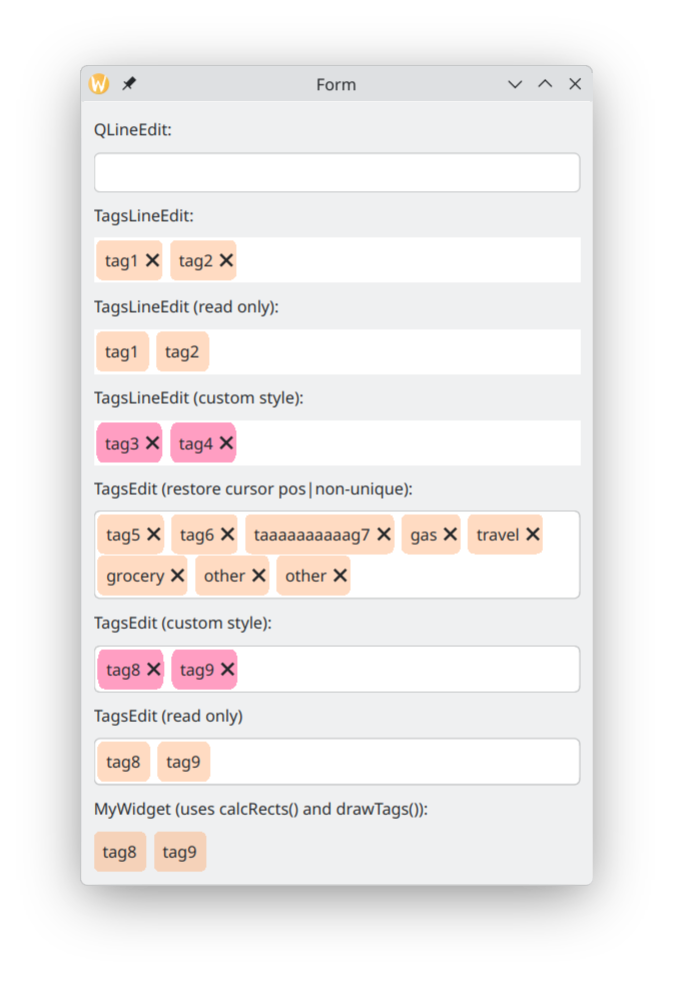

[](https://github.com/nicktrandafil/tags/actions/workflows/ci.yml)
[](https://github.com/nicktrandafil/tags/actions/workflows/ci_pybindings.yml)

# tags

A widget (Qt5/Qt6) for tag editing



## Python instructions:

```bash
mkdir build
cmake . -B build -G Ninja \
  -DCMAKE_BUILD_TYPE=Release \
  -DCMAKE_INSTALL_PREFIX=$(pwd)/py/EverloadTags
ninja -C build/
ninja -C build/ install
cd py
python demo.py
```

You can either:
Use pip to add EverloadTags to your site-packages

```bash
pip install ./py
```

Copy the py/EverloadTags folder to your python project and import see demo.py

You can also follow github actions workflows if the above doesn't work.

## Shortcuts

1. Ctrl+Left - edit previous tag.
2. Ctrl+Right - edit next tag tag.
3. Ctrl+Home - edit the first tag.
4. Ctrl+End = edit the last tag.

For multi-line tag widget Up and Down keys navigate between lines.
